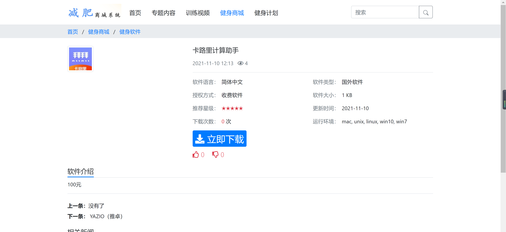

<h1 align="center">减肥商城管理系统</h1>

## 简介
减肥商城管理系统：角色分为管理员、用户；功能包括商品浏览、购物车、订单管理、用户登录、文章和栏目管理、网站设置、训练视频、健身计划。设计简洁，提升用户体验。    --计算机毕业设计源码；毕设源码；java毕业设计源码

## 联系方式

<h3 align="center">获取完整代码与数据库文件 + 微信：deepguan QQ: 86050149 QQ群: 783742310</h3>

<h3 align="center">可帮忙远程部署 包运行成功！提供远程部署、修改代码、设计文档指导、代码讲解等服务！</h3>

## 功能介绍（完整见运行截图）
管理员： 基本功能：登录，注册，退出。内容管理：可管理文章、栏目、附件、生成任务，并配置用户设置，添加、编辑、删除内容。界面操作：支持栏目搜索和筛选，并进行详细的栏目配置。网站设置：进行基本站点信息配置，水印与自定义设定，SEO选项及页面显示控制。   
用户： 网站导航：访问首页、专题内容、训练视频、健身商城、健身计划等。商品管理：浏览、搜索、查看商品详情，使用购物车功能，并支持在线付款。文章与互动：查看和互动文档内容，如缩放、全屏查看；视频播放、点赞、评论功能。信息获取：通过新闻、视频等更新获取减肥和健身资讯。

## 运行截图

本代码来源于网络,仅供学习参考使用!

